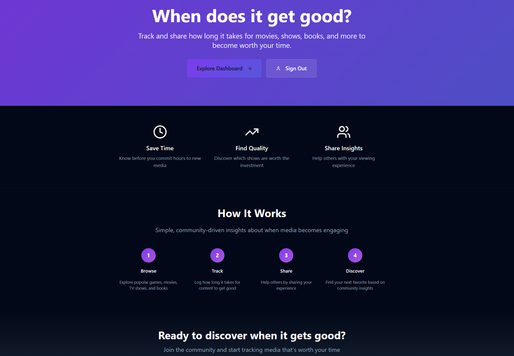

# WIGG

WIGG is a storytelling insight platform that helps fans capture how film, TV, games, and podcasts land in the moment. The web app pairs rich logging tools with interactive visualizations so you can compare arcs, track pacing, and surface the scenes that mattered most.



## Highlights
- Live and retro logging flows with Moment Capture, swipe ratings, timeline notes, and game completion tracking
- Goodness, pacing, and consensus visualizations (GoodnessCurve, PacingBarcode, WiggMap, RealTimeVisualization)
- Supabase-backed sync with LLM-powered smart search, podcast search, and other edge functions
- Shared TypeScript monorepo powering the Vite web app, Storybook UI library, and experimental native surfaces

## Repository Layout
- `src/` &mdash; primary React + TypeScript web app (components, pages, hooks, contexts, integrations)
- `apps/web` & `apps/native` &mdash; platform-specific shells and examples
- `packages/shared` &mdash; cross-platform utilities and Wigg data helpers (`@shared/wigg/*`)
- `public/` &mdash; static assets served by Vite
- `docs/` &mdash; feature notes, MCP setup, and integration guides
- `supabase/` &mdash; edge functions, migrations, and Supabase wiring

## Getting Started

### Prerequisites
- Node.js 18 or newer (use [nvm](https://github.com/nvm-sh/nvm#installing-and-updating) for easy installs)
- npm 10+
- Access to the Supabase project backing the app

### Install & Run
```bash
git clone <repo-url>
cd wigg
npm install
npm run dev
```
The dev server defaults to `http://localhost:5173` with hot module reloading.

### Environment Configuration
Copy `.env.example` to `.env` (never commit secrets). At minimum you need:
```env
VITE_SUPABASE_URL="https://<your-project>.supabase.co"
VITE_SUPABASE_PROJECT_ID="<project-ref>"
VITE_SUPABASE_PUBLISHABLE_KEY="<anon-key>"
VITE_TMDB_API_KEY="<tmdb-api-key>"
```
Additional provider credentials (Podcast Index, Spotify, etc.) should be added as Supabase function secrets rather than `VITE_*` variables. See `docs/mcp-supabase.md` for details.

## Development Workflow
- `npm run dev` &mdash; start Vite with HMR
- `npm run build` &mdash; production build to `dist/`
- `npm run build:dev` &mdash; faster development build
- `npm run preview` &mdash; serve the production build locally
- `npm run lint` &mdash; ESLint with React Hooks/Refresh rules
- `npm test` &mdash; Vitest (single run). Use `npx vitest` for watch mode
- `npm run storybook` / `npm run build-storybook` &mdash; component explorer

## Testing & Quality
- Tests live alongside source in `**/__tests__` with `.test.ts(x)` suffixes
- Prefer user-oriented tests via Testing Library; mock external APIs as needed
- Fix all ESLint findings before pushing (`eslint.config.js` governs shared rules)

## Supabase Edge Functions
Edge functions live under `supabase/functions/` (e.g., `smart-search`, `podcast-search`, `podcast-trending`). Use the Supabase CLI to manage secrets and deploy:
```bash
supabase secrets set <KEY>=<VALUE> --project-ref <project>
supabase functions deploy podcast-search --project-ref <project>
```
Refer to `docs/mcp-supabase.md` for MCP integration and deployment workflows.

## Storybook & UI Review
Run `npm run storybook` to explore components (e.g., GoodnessCurve, PacingBarcode, TitleHeader) in isolation. Stories live in `src/stories/` and should accompany complex UI updates.

## Documentation & References
- `docs/smart-search.md` &mdash; LLM-powered media search architecture
- `docs/wiggmap.md` &mdash; WiggMap rendering and shared types
- `docs/wigg-ui-test-plan.md` &mdash; end-to-end UI validation checklist
- `docs/mcp-supabase.md` &mdash; Supabase MCP setup, secrets, and deployment tips

## Contributing
Follow the repository guidelines in `AGENTS.md`:
- Use path aliases (`@/*`, `@shared/*`) and keep components in PascalCase
- Co-locate tests, prefer deterministic patterns, and write clear commit messages (Conventional Commit style)
- Run linting and tests before opening a PR

## Deployment
Build with `npm run build`; the optimized output is placed in `dist/` and can be served by any static host (Vercel, Netlify, Supabase Hosting, etc.). Ensure required Supabase functions are deployed and environment secrets are configured in the target environment.

## License
License details have not been specified for this repository. Treat the codebase as private unless told otherwise.
